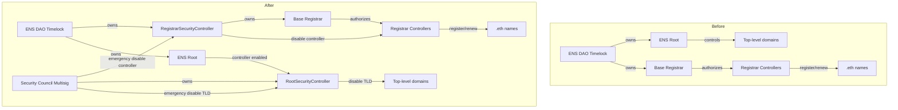

# Enable Security Controllers — Structure & Scope

This document describes how authority flows **before** and **after** enabling the
`RootSecurityController` and `RegistrarSecurityController`, and which actions each
role can perform.

## Diagram (Before vs After)

## What Changes in Practice

- **Before**: only the DAO timelock can remove registrar controllers or change
  root controller status, requiring a full proposal cycle.
- **After**: the security council can **immediately disable** a compromised
  registrar controller or TLD, while the DAO retains full governance control
  over long-term configuration.

## Scope of Authority

### RootSecurityController (owned by Security Council Multisig)

Enables emergency **TLD shutdown**:

- `disableTLD(label)` — takes ownership of a TLD and clears its resolver

This allows the security council to rapidly disable compromised or vulnerable
TLDs without waiting for a full DAO vote.

### RegistrarSecurityController (owned by ENS DAO Timelock)

Preserves DAO governance over `.eth` while enabling emergency **controller shutdown**:

**DAO (Owner)**
- `addRegistrarController(address)`
- `removeRegistrarController(address)`
- `setRegistrarResolver(address)`
- `transferRegistrarOwnership(address)`

**Security Council (Controller)**
- `disableRegistrarController(address)` — emergency removal only

## Rollback Plan (Return to “Before” State)

If the DAO decides to revert to the original governance-only model, it can
execute the following actions via the **ENS DAO Timelock**:

1. **Revoke RootSecurityController from Root**
   - Call `Root.setController(rootSecurityController, false)`
   - Effect: RootSecurityController loses the ability to manage TLD ownership.

2. **Transfer Base Registrar ownership back to the Timelock**
   - Call `BaseRegistrar.transferOwnership(ENS_DAO_Timelock)`
   - Effect: RegistrarSecurityController is no longer the registrar owner.

3. **(Optional) Remove Security Council controller permissions**
   - Call `RegistrarSecurityController.setController(securityCouncilMultisig, false)`
   - Effect: Security council can no longer disable registrar controllers.
   - Preference: Step 2 already removes the controller’s authority by restoring
     timelock ownership of the registrar, which avoids accumulating legacy
     permissioned contracts in the execution path.

After these steps, control returns to the pre-proposal state where only the DAO
timelock can manage registrar controllers and root permissions.
